# securePipeline
Uma meneira de integrar mais segurança ao seu CI e seu código!

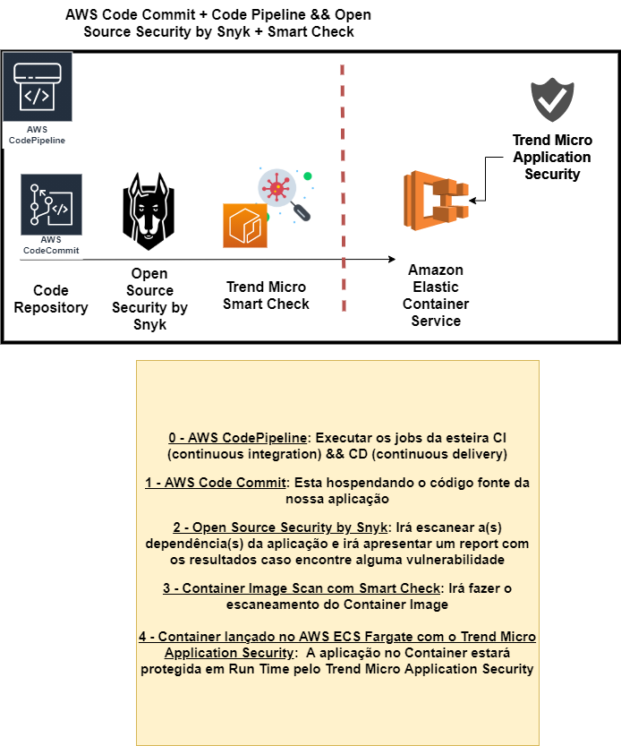 </img>

### Você precisará:

-   1 Conta da AWS com usuário com direitos de administrador e com credencias de Git para o AWS CodeCommit;
-   Ter o Git instalado localmente na sua máquina; 
-   1 Conta já criada no <a href="https://cloudone.trendmicro.com/"> Trend Micro Cloud One </a>; 
-   Ter o <a href="https://www.trendmicro.com/product_trials/download/index/br/168"> Trend Micro - Smart Check </a> instalado e pronto;

### Links para refêrencia:

- <a href="https://docs.aws.amazon.com/codecommit/latest/userguide/setting-up-gc.html"> Configuração para usuários HTTPS usando credenciais Git </a>

- <a href="https://docs.aws.amazon.com/codecommit/latest/userguide/getting-started.html#getting-started-create-commit"> Introdução ao Git e AWS CodeCommit </a>

### Essa demo irá criar:

-   2 Templates no AWS CloudFormation;
-   1 Repositório no AWS CodeCommit;
-   1 Build/ Projeto de Compilação no AWS CodeBuild;
-   1 Pipeline no AWS CodePipeline;
-   1 Bucket no AWS S3;
-   11 Parâmetros no AWS Systems Manager;
-   2 Roles no AWS IAM Role;
-   1 Registry Privado e 1 Repositório no AWS ECR - Elastic Container Registry;

 

 

## Como Usar:

 

  
:point_down: CONFIGURAÇÕES ADICIONAIS/ OPCIONAIS 

 

  
:zap: USANDO O AWS CODECOMMIT

 

## Caso você já tenha algum repositório no CodeCommit, pode pular essa etapa e testar o seu código já existente.

 

1- Clone o Repositório para a sua máquina: https://github.com/SecurityForCloudBuilders/Protect-a-Vulnerable-WebApplication.git

    git clone https://github.com/SecurityForCloudBuilders/Protect-a-Vulnerable-WebApplication.git

2- Execute o template codecommit.repository.template.yaml na Console da AWS -> Cloud Formation

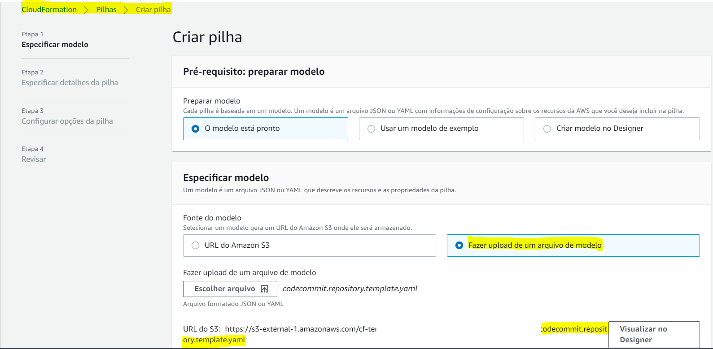 </img>

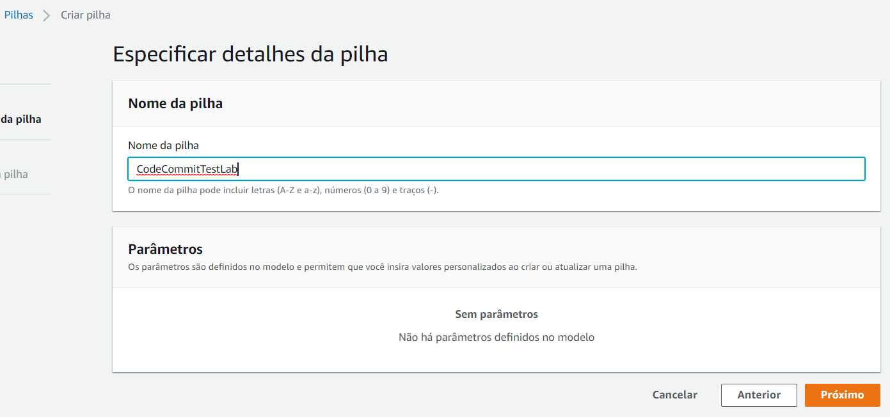 </img>

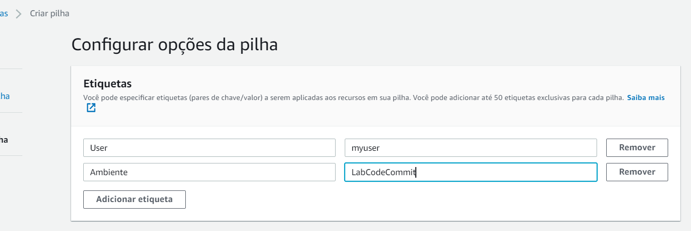 </img>

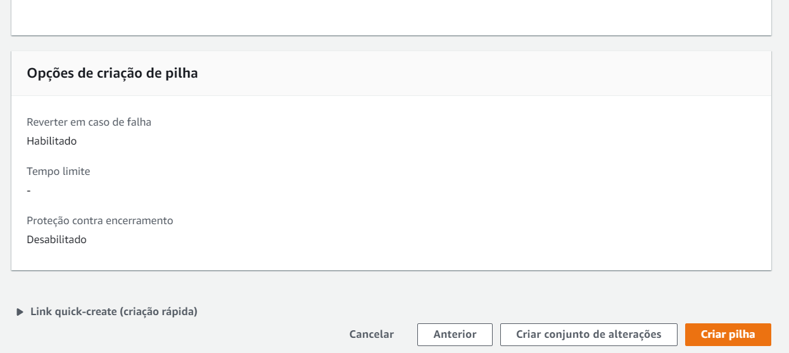 </img>

2.5- Espere até que essa Stack apareça como "CREATE_COMPLETE"

 </img>

3- Vá até o serviço "CodeCommit", nele irá aparecer um novo repositório vazio chamado "MyVulnerableApp"

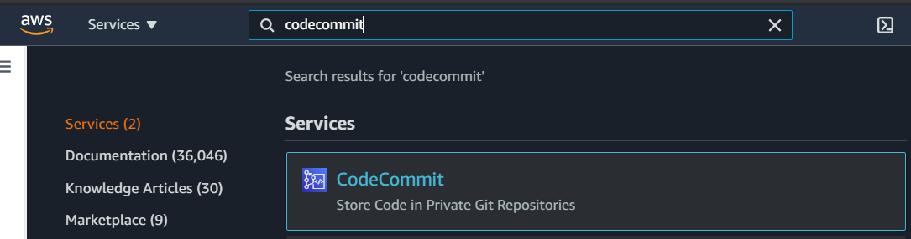 </img>

4- Nessa mesma tela, do lado direito do nome desse repo, clique no botão azul "HTTPS" que aparece abaixo da frase "Clonar URL"

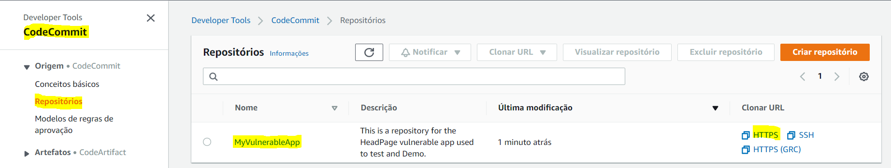 </img>

5- Também Clone esse Repositório para a sua máquina. Copie todo o conteúdo do primeiro repo (Protect-a-Vulnerable-WebApplication) e cole nesse diretório/ repositório (MyVulnerableApp)

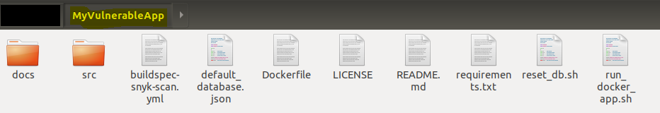 </img>

6- Faça o push para o AWS CodeCommit do repositório (MyVulnerableApp)

    git add .

    git commit -m "My first Commit"

    git push

 

  

    
:pizza: CRIAÇÃO DE UM REGISTRY PRIVADO NO AWS ELASTIC CONTAINER REGISTRY (ECR)  

  
   

  ## Caso você já tenha alguma imagem no ECR, pode pular essa etapa e testar a sua imagem já existente.

  1- Execute o template ecr.registry.template.yaml na Console da AWS -> Cloud Formation

  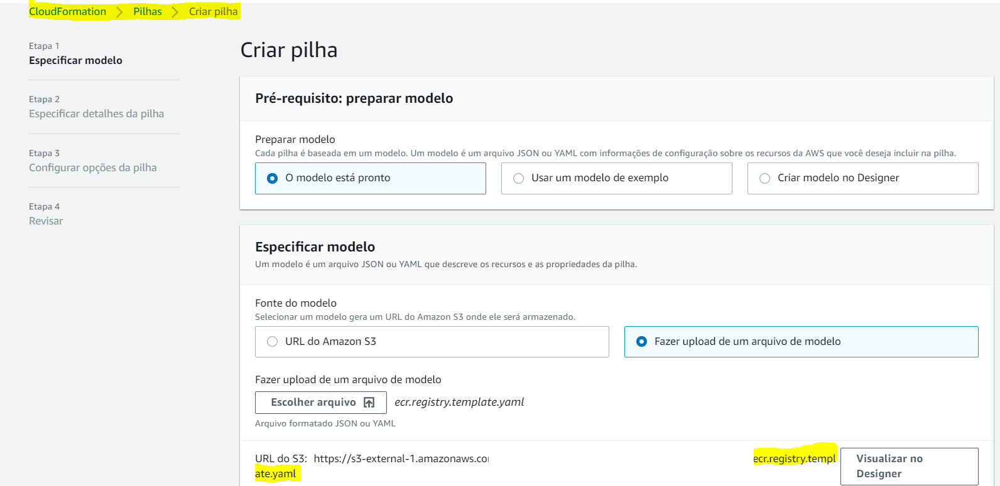 </img>

  2- Esse template precisa que você providencie 2 parâmetros. O primeiro é o nome que quer para o seu Repositório <b> RepositoryName </b> e o outro é o <b> ECRScan </b> com os valores de <b>[true] </b> ou <b> [false] </b> para caso queira utilizar também o <a href="https://docs.aws.amazon.com/AmazonECR/latest/userguide/image-scanning.html"> escaneamento de imagens </a> disponivel no próprio ECR

  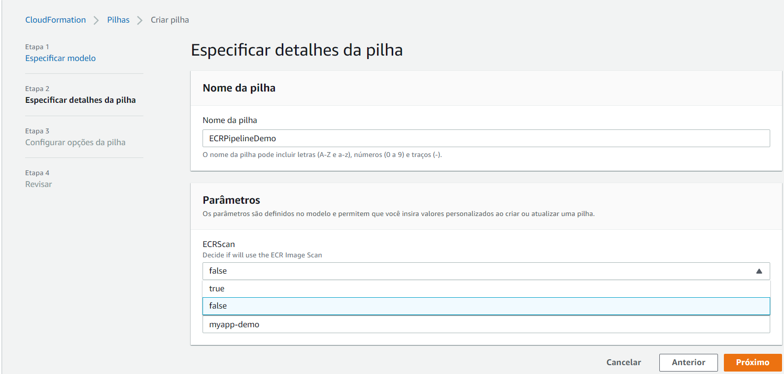 </img>

  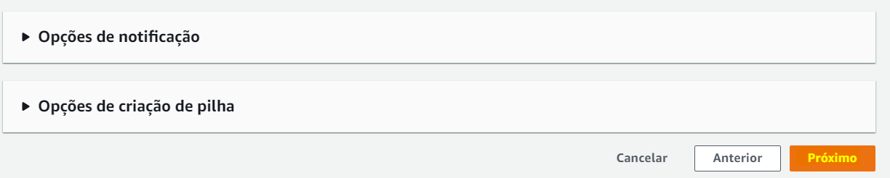 </img>

  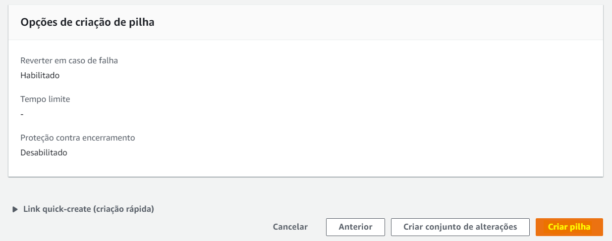 </img>

  3- Espere até que essa Stack apareça como "CREATE_COMPLETE"

  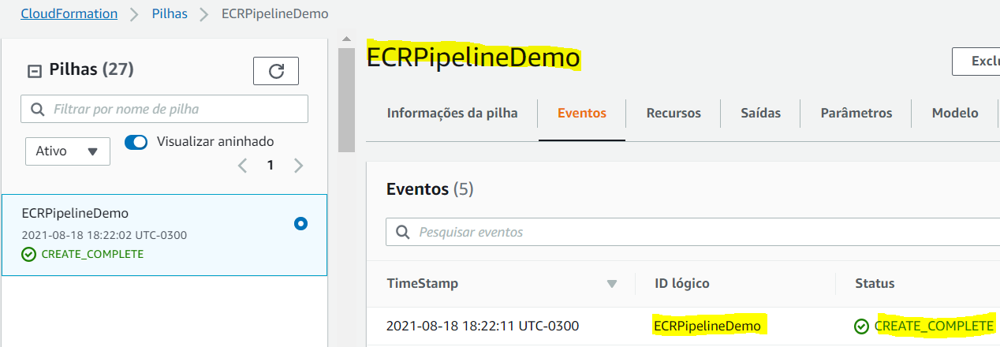 </img>

  4- Para ir até o Registry criado, vá até o serviço "Elastic Container Registry", para isso, nessa mesma tela do Cloud Formation e no template que acabou de ser criado, clique na aba "Saída" ou "Outputs", e clique no link que aparece ao lado do nome "RegistryName"

  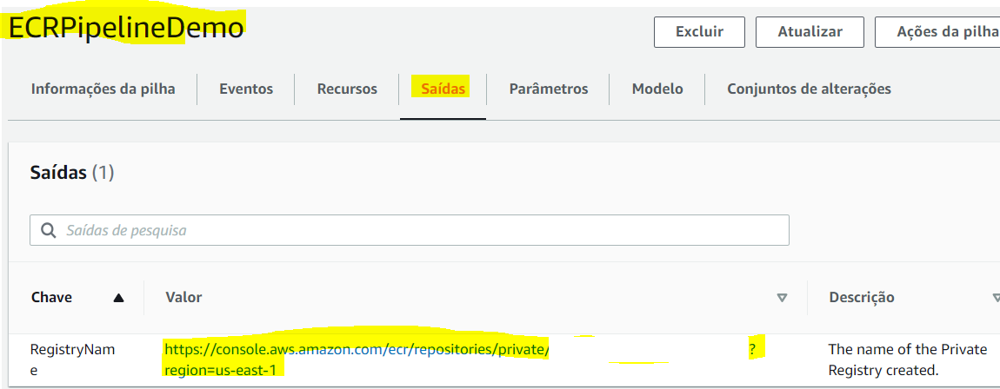 </img>

  5- Clique no botão "View push commands", siga as instruções que aparecem na tela e faça o push da sua imagem;
  
  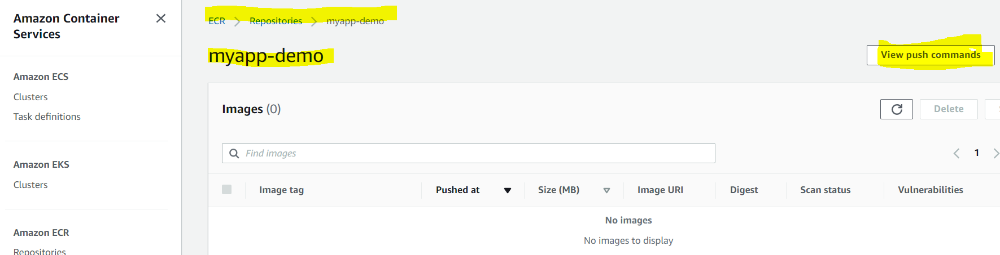 </img>

  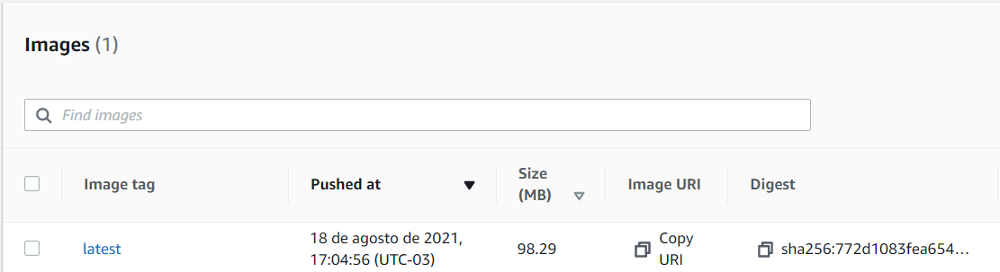 </img>

  5.5- Caso queira, nesse repositório você tem um Dockerfile para usar como exemplo: https://github.com/SecurityForCloudBuilders/Protect-a-Vulnerable-WebApplication/blob/master/Dockerfile

  

 

 

  
:hand: USANDO O AWS CODEBUILD E CODEPIPELINE 

 

7- Agora, faça o deploy do template "main.pipeline.template.yaml". Para isso, vá até o serviço do "Cloud Formation"

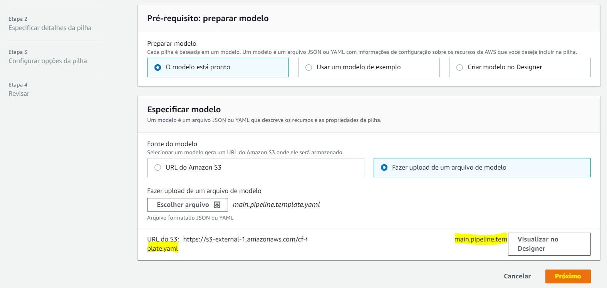 </img>

8.5- Esse template precisa que você providencie 12 parâmetros. 

- Para encontrar o <a href="https://support.snyk.io/hc/en-us/articles/360004008258-Authenticate-the-CLI-with-your-account#UUID-4f46843c-174d-f448-cadf-893cfd7dd858_UUID-cc337985-30e2-aac4-db7d-934b7e25134b"> Snyk Token</a>. 

- Para pegar o seu Smart Check Token, consulte a <a href="https://deep-security.github.io/smartcheck-docs/api/index.html#operation/createSession"> API</a>. 

- E no caso do parâmetro "SmartCheckURL" coloque a URL do Smart Check mais <a href="https://deep-security.github.io/smartcheck-docs/api/index.html#operation/createScan">/api/scans</a>. 

      Por exemplo: https://smartcheck.example.com/api/scans

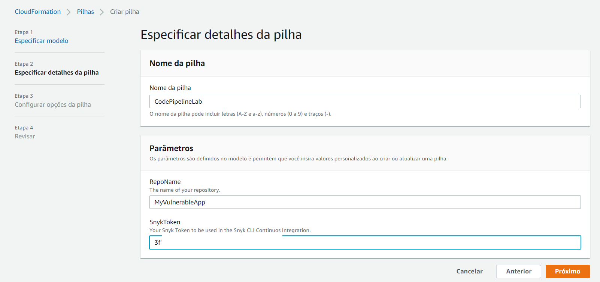 </img>

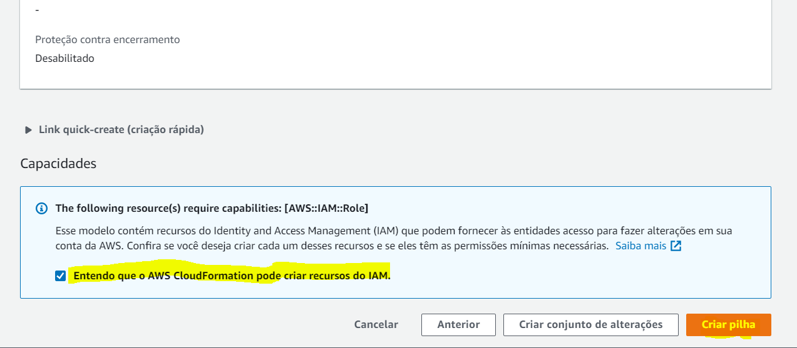 </img>

7.5- Espere até que essa Stack apareça como "CREATE_COMPLETE"

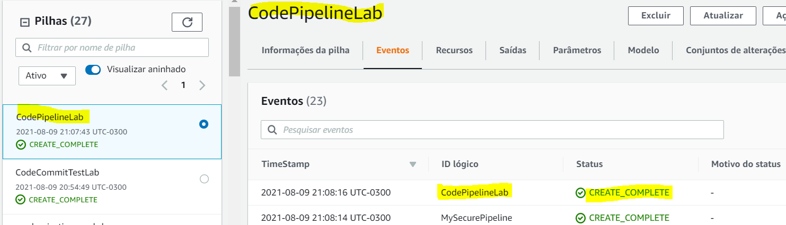 </img>

8- Para ver o resultado do Scan, vá ate o serviço "CodePipeline", para isso, nessa mesma tela do Cloud Formation e no template que acabou de ser criado, clique na aba "Saída" ou "Outputs", e clique no link que aparece ao lado do nome "SecurePipeline"

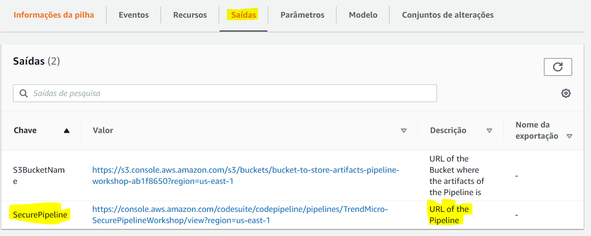 </img>

9- Você será redirecionado para o Pipeline criado que já está sendo executado. Na segunda etapa com o nome "Scan-The-Code-With-Snyk-CLI", clique em detalhes 

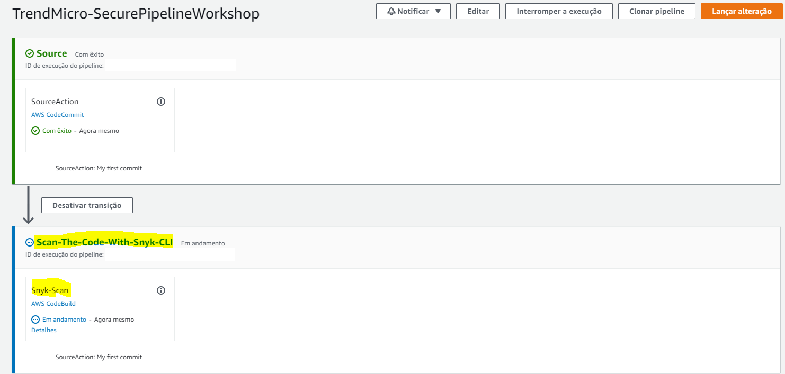 </img>

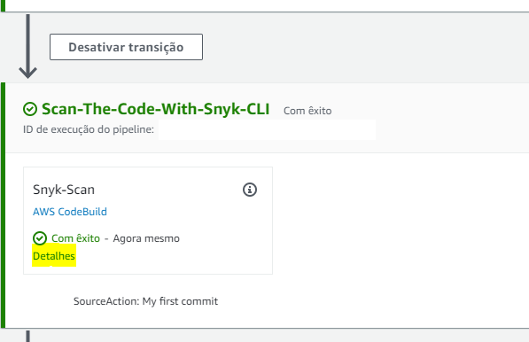 </img>

10- Você será redirecionado para o "CodeBuild" e diretamente na compilação onde acontece o escaneamento do código. Vá até as últimas linhas do Log da Compilação.

11- Nessas últimas linhas verá que foi gerado um link "Explore this snapshot at https://app.snyk.io/org/mais-alguma-coisa-aqui", copie esse link e cole no seu navegador. 

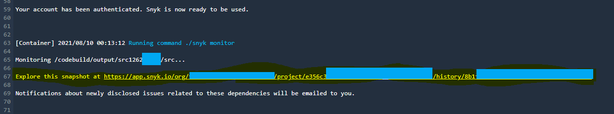 </img>

12- O report com os findings estará todo detalhado nele. 

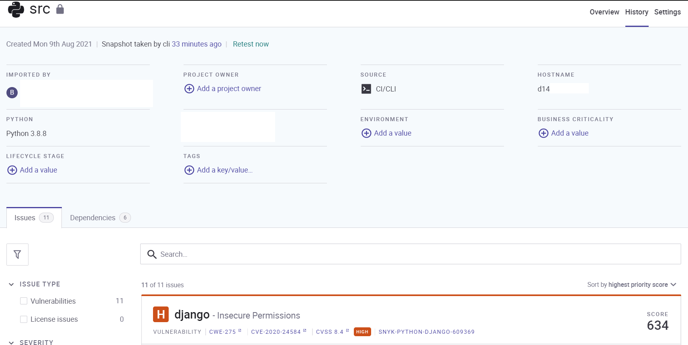 </img>

13- Logo após a fase "Scan-The-Code-With-Snyk-CLI" for executada com êxito. A terceira etapa desse Pipeline começara a executar, e a fazer o escaneamento da Imagem de um container. Clique em detalhes.

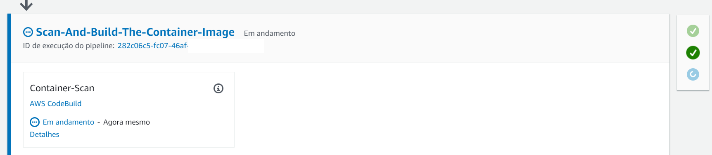 </img>

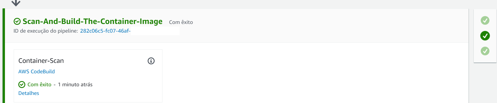 </img>

14- Você será redirecionado para o "CodeBuild" e diretamente na compilação onde acontece o escaneamento da imagem. Vá até as últimas linhas do Log da Compilação.

15- Nessas últimas linhas verá que aparecerá:

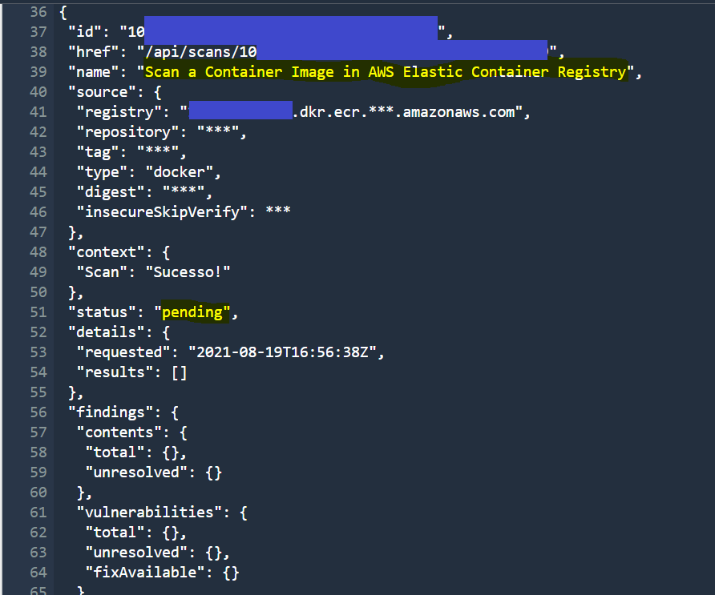 </img>

15.5 - Vá até a console do <b> SmartCheck </b>, na coluna esquerda, clique em <b> "Scans" </b>. A imagem já estará sendo escaneada. Clique no Scan dessa imagem ou espere ela concluir e veja os resultados do Scan. 

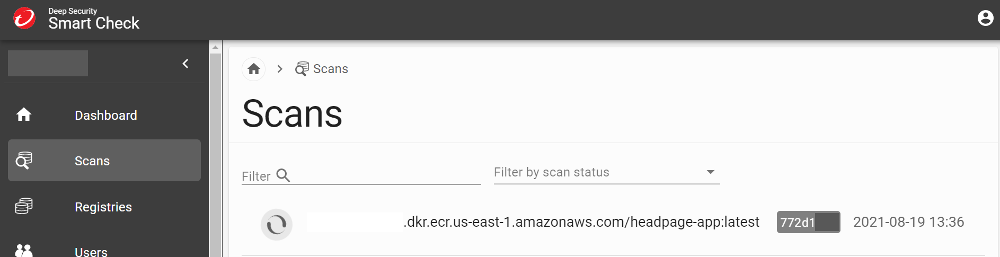 </img>

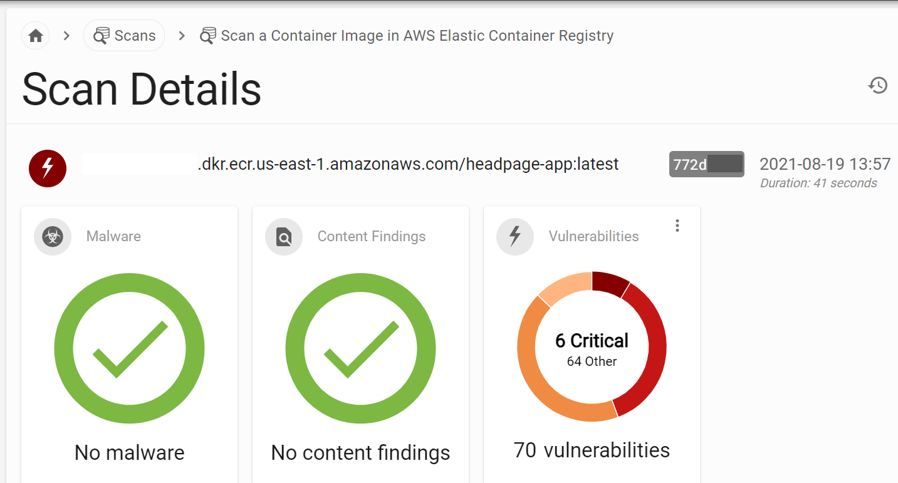 </img>

 

### WARNING:

        - Este projeto é para o propósito de Demostrações! 
        - Não foi criado para ser usado em produção ou com dados sensiveis!
