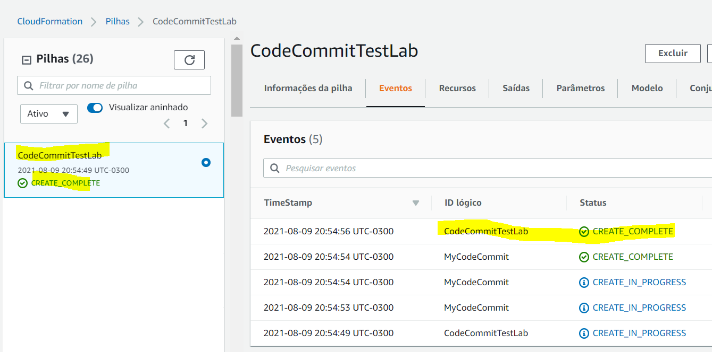

# securePipeline
Uma meneira de integrar mais segurança ao seu CI e seu código!

 </img>

### Você precisará:

-   1 Conta da AWS com usuário com direitos de administrador e com credencias de Git para o AWS CodeCommit;
-   Ter o Git instalado localmente na sua máquina; 
-   1 Conta já criada no Trend Micro Cloud One; 

### Links para refêrencia:

- <a href="https://docs.aws.amazon.com/codecommit/latest/userguide/setting-up-gc.html"> Configuração para usuários HTTPS usando credenciais Git </a>

- <a href="https://docs.aws.amazon.com/codecommit/latest/userguide/getting-started.html#getting-started-create-commit"> Introdução ao Git e AWS CodeCommit </a>

### Essa demo irá criar:

-   2 Templates no AWS CloudFormation;
-   1 Repositório no AWS CodeCommit;
-   1 Build/ Projeto de Compilação no AWS CodeBuild;
-   1 Pipeline no AWS CodePipeline;
-   1 Bucket no AWS S3;
-   1 Parâmetro no AWS Systems Manager;
-   2 Roles no AWS IAM Role;

 

 

## Como Usar:

 

  
:zap: USANDO O AWS CODECOMMIT

 

## Caso você já tenha algum repositório no CodeCommit, pode pular essa etapa e testar o seu código já existente.

 

1- Clone o Repositório para a sua máquina: https://github.com/SecurityForCloudBuilders/Protect-a-Vulnerable-WebApplication.git

    git clone https://github.com/SecurityForCloudBuilders/Protect-a-Vulnerable-WebApplication.git

2- Execute o template codecommit.repository.template.yaml na Console da AWS -> Cloud Formation

 </img>

 </img>

 </img>

 </img>

2.5- Espere até que essa Stack apareça como "CREATE_COMPLETE"

 </img>

3- Vá até o serviço "CodeCommit", nele irá aparecer um novo repositório vazio chamado "MyVulnerableApp"

 </img>

4- Nessa mesma tela, do lado direito do nome desse repo, clique no botão azul "HTTPS" que aparece abaixo da frase "Clonar URL"

 </img>

5- Também Clone esse Repositório para a sua máquina. Copie todo o conteúdo do primeiro repo (Protect-a-Vulnerable-WebApplication) e cole nesse diretório/ repositório (MyVulnerableApp)

 </img>

6- Faça o push para o AWS CodeCommit do repositório (MyVulnerableApp)

    git add .

    git commit -m "My first Commit"

    git push

 

 

  
:hand: USANDO O AWS CODEBUILD E CODEPIPELINE 

7- Agora, faça o deploy do template "main.pipeline.template.yaml". Para isso, vá até o serviço do "Cloud Formation"

 </img>

8.5- Esse template precisa que você providencie 2 parâmetros. O primeiro é o seu <a href="https://support.snyk.io/hc/en-us/articles/360004008258-Authenticate-the-CLI-with-your-account#UUID-4f46843c-174d-f448-cadf-893cfd7dd858_UUID-cc337985-30e2-aac4-db7d-934b7e25134b"> Snyk Token </a> (Consegue encontrar ele na console do Open Source Security) e o outro é o nome do seu repositório, que no nosso caso (e se você estiver seguindo ele) é MyVulnerableApp

 </img>

 </img>

7.5- Espere até que essa Stack apareça como "CREATE_COMPLETE"

 </img>

8- Para ver o resultado do Scan, vá ate o serviço "CodePipeline", para isso, nessa mesma tela do Cloud Formation e no o template que acabou de ser criado, clique na aba "Saída" ou "Outputs", e clique no link que aparece ao lado do nome "SecurePipeline"

 </img>

9- Você será redirecionado para o Pipeline criado que já está sendo executado. Na segunda etapa com o nome "Scan-The-Code-With-Snyk-CLI", clique em detalhes 

 </img>

 </img>

10- Você será redirecionado para o "CodeBuild" e diretamente na compilação onde acontece o escaneamento do código. Vá atá as últimas linhas do Log da Compilação.

11- Nessas últimas linhas verá que foi gerado um link "Explore this snapshot at https://app.snyk.io/org/mais-alguma-coisa-aqui", copie esse link e cole no seu navegador. 

 </img>

12- O report com os findings estará todo detalhado nele. 

 </img>

